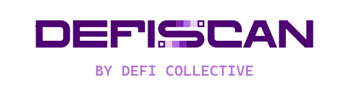

A public website for the monitoring of the maturity and risks of DeFi technology.

Read more about the methodology behind the DeFi stages and risks in this [post](https://deficollective.org/blog/introducing-defiscan).

DeFiScan is built and maintained by the [DeFi Collective](https://DeFiCollective.org), a non-profit organization with the mission to make DeFi more transparent and secure for all.

## 🌟 Community Program

💪 Join DeFiScan’s Community Review Program and help enhance the coverage of Decentralization of DeFi protocols!

💰 Total Prize Pool: 10,000 LUSD! Each successful review earns you 500 LUSD. Your contributions will make a real impact on the DeFi ecosystem! ✨

🤝 Who Can Participate? Anyone! Whether you're a seasoned expert or just passionate about DeFi, we want your insights. Just submit your reviews via a pull request (PR) on our GitHub. 📝

Check details on the program 👉 [here](./campaigns/README.MD) 👈

## Run App

To run the website on your local machine, follow these steps:

1. **Clone the repository**:

   ```bash
   git clone https://github.com/deficollective/defiscan.git
   ```

   After successful cloned. Head over to the project directory

   ```bash
   cd defiscan
   ```

2. **Install Dependencies**:

   Navigate into the project directory and install the required dependencies:

   ```bash
   npm install
   ```

3. **Run the Development Server**:

   Start the app in development mode with the following command:

   ```bash
   npm run dev
   ```

   Head over to your browser and access the `localhost:3000`

4. **Build the App**:

   To build the app, run the following command:

   ```bash
   npm run build
   ```

---

## Add New Protocol Review

New protocol reviews can be added as a `.md` files in the `content/protocols` folder.

**Important:**

- Make sure to name the file with dash (`-`) and without space. Example: `liquity-v2.md`
- The `.md` file needs to follow the protocol report structure outlined [here](src/content/template.md)

## Acknowledgement

### L2Beat

This project utilizes the pizza diagrams developed and used inside L2Beat. We are grateful for their commitment to open access and knowledge sharing.

Their original work is open-sourced under the permissive MIT License, and we acknowledge their contribution.

### DefiLlama

We also thank DefiLlama for providing comprehensive DeFi data through their API, specifically the historical chain TVL and protocol data that powers our analytics. Their commitment to transparent and accessible DeFi data has been invaluable to this project.
